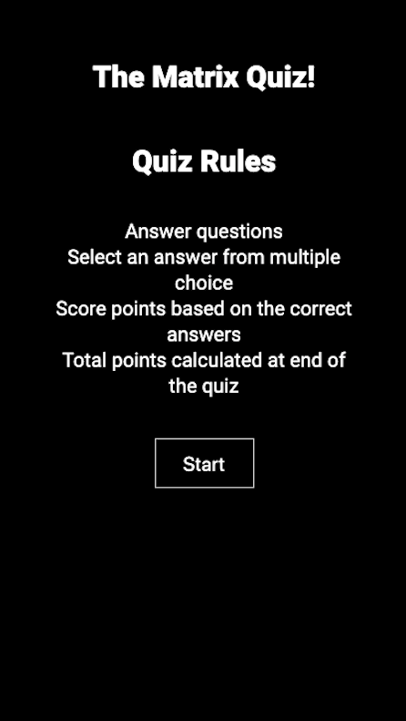
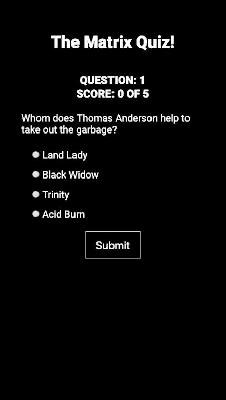
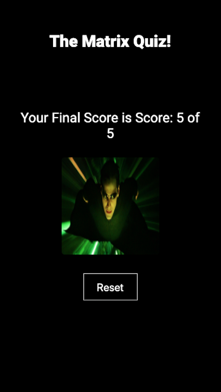

# The Matrix Quiz App

> A multiple choice quiz .

## Live App link

- https://wificowboy.github.io/Quiz-App/

## App Images

  
  
  
  

## Summary

The Matrix Quiz App is a multiple choice quiz based on the hit movie The Matrix. The user starts the quiz and answers a question based on multiple answers, the user is then rendered an animated Gif based on correct or incorrect answer. The score is displayed based on the number of correct questions answered. A final score is displayed at the end with a distinct gif based on the total score.

## Technology Stack

### Front End

- HTML5
- CSS
- JavaScript
- jQuery

### Development Environment

- Git
- GitHub
- iTerm CLI
- Visual Studio Code

## Contributors

This application was built by [Humberto Hernandez](https://github.com/WiFiCowboy)
